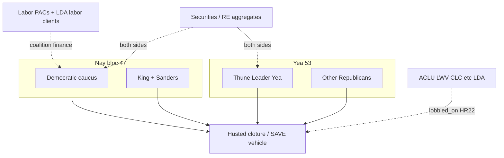

# Scale pattern mine (I6): SAVE America cloture Nay bloc × Thune

**Status:** Published research product (human editor gate for external reuse)  
**Playbook:** **I6** — [`ops/ai-scale-pattern-mining.md`](../ops/ai-scale-pattern-mining.md) · [`METHODOLOGY.md`](../METHODOLOGY.md) §7.5–§7.7  
**Target:** Mar 26, 2026 cloture on Husted Amdt. #4732 (SAVE America vehicle / S. 1383 House message) — **Nay bloc** + **Sen. John Thune** (Yea / Majority Leader)  
**Companions:** [`claim-triage-thune-save-act-deep.md`](claim-triage-thune-save-act-deep.md) (Appendix A) · [`influence-save-act-senate-stall.md`](influence-save-act-senate-stall.md) · [`save-act-senate-stall-stress-test.md`](save-act-senate-stall-stress-test.md)  
**Pass date:** 2026-08-02  
**Human editor:** CFMI bootstrap  
**Interest disclosure (editor):** none

Educational research only—not legal advice, voting instructions, or counsel to any person.

**Honesty preamble:** This pass shards public filings and official roll calls. **Suspicion flags are publishable by design.** Corruption / quid pro quo remains **not established** unless a public-record chain ties payment or privilege to a specific official act. News items are **leads only**.

---

## 1. Dig frame

| Field | Value |
|-------|-------|
| **Bill / vehicle** | SAVE America Act via House message to accompany **S. 1383**; cloture on **Husted Amdt. #4732** (photo ID) |
| **Roll call** | [Senate vote 119-2-00073](https://www.senate.gov/legislative/LIS/roll_call_votes/vote1192/vote_119_2_00073.htm) · Mar 26, 2026 · **53–47** (60 needed) · Rejected |
| **Daily Press** | [Thursday, March 26, 2026](https://www.dailypress.senate.gov/thursday-march-26-2026/) |
| **Pattern classes** | Donor ↔ vote timing · Advocacy org ↔ member overlaps · Revolving door · Opaque IE vehicles · Schedule priority inversion (cross-ref Thune deep dig) |
| **Shards run** | Votes/cosponsors · FEC/OS top industries (sample) · LDA/OS H.R. 22 · IE notes · Revolving door (quick) |
| **Shards deferred** | Full FEC itemized top-N for all 47 Nays · 990 officer→office edges · STOCK/PFD · Bill-text clones · State (SD) registries · Full LDA direction census |

---

## 2. Cloture blocs (official record)

**Result:** Cloture Motion Rejected — YEAs **53** · NAYs **47**.

### 2.1 Yea (53) — includes Leader Thune

All voting Republicans Yea on this cloture, including **Thune (R-SD)** and **Murkowski (R-AK)**. Full Yea list: [Senate roll call](https://www.senate.gov/legislative/LIS/roll_call_votes/vote1192/vote_119_2_00073.htm) (Grouped By Vote Position).

### 2.2 Nay (47) — complete list

Party-line Democratic caucus + Independents caucusing with Democrats. **Zero Republican Nays** on this SAVE-related cloture.

| | Senators (Nay) |
|--|----------------|
| **D** | Alsobrooks (MD), Baldwin (WI), Bennet (CO), Blumenthal (CT), Blunt Rochester (DE), Booker (NJ), Cantwell (WA), Coons (DE), Cortez Masto (NV), Duckworth (IL), Durbin (IL), Fetterman (PA), Gallego (AZ), Gillibrand (NY), Hassan (NH), Heinrich (NM), Hickenlooper (CO), Hirono (HI), Kaine (VA), Kelly (AZ), Kim (NJ), Klobuchar (MN), Lujan (NM), Markey (MA), Merkley (OR), Murphy (CT), Murray (WA), Ossoff (GA), Padilla (CA), Peters (MI), Reed (RI), Rosen (NV), Schatz (HI), Schiff (CA), **Schumer (NY)**, Shaheen (NH), Slotkin (MI), Smith (MN), Van Hollen (MD), Warner (VA), Warnock (GA), Warren (MA), Welch (VT), Whitehouse (RI), Wyden (OR) |
| **I** | King (ME), Sanders (VT) |

**Source:** [Senate vote 119-2-00073](https://www.senate.gov/legislative/LIS/roll_call_votes/vote1192/vote_119_2_00073.htm).

**Pattern note (coalition):** The Nay bloc is **caucus-complete**, not a mixed ideological subset. That raises the prior for **party discipline / stated access policy** over idiosyncratic donor scripts—and is also the strongest false-positive control for “shared payor bought the vote.”

---

## 3. FEC / OpenSecrets sample — leadership + Nay contrast

Cycle tables below are **aggregate industries** (OpenSecrets coding of FEC employer/occupation). They are **(A) disclosed finance**, not SAVE earmarks. 2026 cycle itemized tables were thin/incomplete on aggregator pages in this pass.

### 3.1 Sen. John Thune (Yea / Leader) — OpenSecrets 2019–2024

| Rank theme | Amount (approx.) | Source |
|------------|------------------|--------|
| Securities & Investment | ~$1.09M | [OS Thune industries](https://www.opensecrets.org/members-of-congress/john-thune/industries?cid=N00004572&cycle=2024) · [summary](https://www.opensecrets.org/members-of-congress/john-thune/summary) |
| Retired | ~$857k | Same |
| Real Estate | ~$692k | Same |
| Leadership PACs | ~$442k | Same |
| Lobbyists | ~$413k | Same |
| Labor (2023–24 senators table) | **$2,500** | [OS Labor → Senators 2024](https://www.opensecrets.org/industries/summary?cycle=2024&ind=P&recipdetail=S) |
| FEC candidate | Friends of John Thune | [S2SD00068](https://www.fec.gov/data/candidate/S2SD00068/) |

### 3.2 Sen. Chuck Schumer (Nay / Minority Leader) — OpenSecrets 2019–2024

| Rank theme | Amount (approx.) | Source |
|------------|------------------|--------|
| Securities & Investment | ~$4.82M | [OS Schumer industries](https://www.opensecrets.org/members-of-congress/charles-e-schumer/industries?cycle=2024) |
| Lawyers/Law Firms | ~$3.19M | Same |
| Retired | ~$3.08M | Same |
| Real Estate | ~$2.59M | Same |
| Lobbyists | ~$800k | Same |
| Labor sector (2019–24) | ~$339k (mostly PACs) | Same |
| Labor (2023–24 senators table) | ~$17.6k | [OS Labor → Senators 2024](https://www.opensecrets.org/industries/summary?cycle=2024&ind=P&recipdetail=S) |
| Top orgs (sample) | Blackstone, NextEra, Paul Weiss, Newmark, KKR… | [OS Schumer contributors](https://www.opensecrets.org/members-of-congress/charles-e-schumer/contributors?cycle=2024) |
| FEC candidate | Friends of Schumer | [S8NY00082](https://www.fec.gov/data/candidate/S8NY00082/) |

### 3.3 Additional Nay samples (industries / labor)

| Actor | Public finance signal | Source | Grade as SAVE-specific |
|-------|----------------------|--------|------------------------|
| **Sanders (I-VT)** | Top: Retired ~$2.58M; Education ~$1.70M; Health Pros ~$887k; Labor sector ~$162k (PACs ~$96k) | [OS Sanders industries](https://www.opensecrets.org/members-of-congress/bernie-sanders/industries?cycle=2024) | Weak / noisy |
| **Baldwin (D-WI)** | Labor ~$407k (2023–24 senators) — among highest Senate labor receipts | [OS Labor → Senators](https://www.opensecrets.org/industries/summary?cycle=2024&ind=P&recipdetail=S) | Moderate *as coalition finance*; not act-specific |
| **Rosen (D-NV)** | Labor ~$377k (2023–24) | Same | Same |
| **Klobuchar (D-MN)** | Labor ~$228k (2023–24) | Same | Same |
| **Hirono / Heinrich / King / Whitehouse / Gillibrand** | Labor ~$155k–$197k each (2023–24) | Same | Same |
| **Party aggregate** | Senate Dems avg labor ~$86k vs Senate GOP avg ~$12k (2023–24) | [OS Labor summary](https://www.opensecrets.org/industries/summary?cycle=2024&ind=P) | Strong *as partisan finance pattern*; weak as vote-buy proof |

**Contrast with Thune:** Finance/real-estate/retired appear on **both** Schumer and Thune → **false-positive control** (industry aggregates fund both sides; do not explain Nay vs Yea). **Labor PACs + H.R. 22 labor/civil-rights LDA clients** concentrate on the Democratic/Independent coalition that cast every Nay—**supported as disclosed coalition finance**, not as a payment→cloture chain.

---

## 4. H.R. 22 / SAVE LDA org list (advocacy overlaps)

| Fact | Source |
|------|--------|
| **46+ unique orgs** registered to lobby on H.R. 22 (119th); aggregator table shows 70 report rows | [OpenSecrets H.R.22](https://www.opensecrets.org/federal-lobbying/bills/summary?id=hr22-119) |
| High report-count clients (2025 samples) | National Cmte to Preserve Social Security (8); Southern Poverty Law Center (8); ACLU (6); AFT, Campaign Legal Center, Common Cause, Defend the Vote, Democracy 21, FAIR, Gun Owners of America, HRC, Leadership Conference, LCV, LWVUS, MoveOn, NYU, SEIU, VPC, VoteVets, AFL-CIO, AMAC, others | Same · [`influence-save-act-senate-stall.md`](influence-save-act-senate-stall.md) §2 |
| **Direction caveat** | Summary table often **does not** label for/against — check LDA report images before asserting side | OS bill page note |
| **Overlap with Nay interests** | Labor clients (AFT, SEIU, AFL-CIO, CWA, Ironworkers) + civil-rights/voting orgs (ACLU, LWV, Leadership Conference, Common Cause, Campaign Legal Center, Defend the Vote, VPC) align with the **stated** Democratic access/suppression critique of SAVE — **mission/coalition overlap**, not a filing that named senators were hired | LDA + floor statements (leads → filings) |
| **FOR-leaning names on same list** | FAIR, AMAC, Gun Owners of America (confirm on LDA images) | Same |
| **Member interest edge** | **Not established in this pass** as board/spouse/staff employment ties from LDA clients into specific Nay offices (990/officer shard deferred) | Gap |

---

## 5. IE / Super PAC notes (2026 SAVE fight)

| Vehicle / claim | What public sources show | Label |
|-----------------|--------------------------|-------|
| Bill-specific IE that **flipped** Mar 26 cloture math | **Not established** in this pass | Gap |
| **SAVE AMERICA** FEC committee [C00762591](https://www.fec.gov/data/committee/C00762591/) | Trump-linked committee; IEs **$0.00** shown for 2025–26 window on FEC overview — **not** a SAVE-bill IE campaign | Do not confuse name with bill |
| **Sentinel Action Fund** [C00811166] | Heritage Action–adjacent Senate super PAC; candidate IEs (e.g. Rogers MI); press claims SAVE-related messaging — **news/press = leads**; FEC Schedule E samples are **candidate-support**, not a cloture-vote purchase trail | Suspicion flag (opaque/outside spend ecosystem) **weak–moderate** as presence; quid pro quo **not established** |
| Musk / Senate Leadership Fund / Thune pressure | Press reporting of Musk criticism + prior SLF gifts + SAVE demands on Thune | **News lead only** — resolve to FEC before publishing as edge |
| Opposing-side IE keyed to SAVE cloture | **Not found** as a named, bill-tagged IE total in this pass | Gap |

---

## 6. Revolving door (quick finds)

| Actor A | Relation | Actor B | Source | Grade |
|---------|----------|---------|--------|-------|
| Schumer office alumni | high revolving-door staff count (tied near top of OS list historically) | K Street / lobbying | [OS Congressional Staffers](https://www.opensecrets.org/revolving-door/congressional-staffers) (counts vary by scrape date) | **Moderate** as leadership revolving-door density; **not established** as SAVE-specific |
| Durbin / Murray offices | similarly high historical staff→lobby counts on OS leaderboard | Lobbying | Same | Pattern note |
| LWVUS lobbyists | ~3 of 9 (2024) previously held government jobs | Federal employment → LWV lobbying | [OS LWVUS summary](https://www.opensecrets.org/orgs/league-of-women-voters-of-the-us/summary?id=D000052977) | **Moderate** classic revolver share; not tied to named Nay vote |
| Walker Gallman | staff → Heritage Action lobbyist | Heritage Action (FOR) | [OS Gallman](https://www.opensecrets.org/revolving-door/summary?id=81789) · influence companion | FOR-side revolver |
| ACLU / Brennan / SPLC lobbyist census × Rules/Judiciary/Homeland staff | — | — | **Not tabulated this pass** | Gap |

---

## 7. Conflict / pattern table (reduce)

| Pattern class | Actor A | Relation | Actor B | Timing / window | Source | **Flag** | **Proof-status** | Notes |
|---------------|---------|----------|---------|-----------------|--------|----------|------------------|-------|
| Coalition / vote | Democratic caucus + King, Sanders | `voted_nay_cloture` | Husted Amdt. #4732 / SAVE America vehicle | Mar 26, 2026 | [Senate 119-2-00073](https://www.senate.gov/legislative/LIS/roll_call_votes/vote1192/vote_119_2_00073.htm) | Suspicion flag (unified bloc = decisive stall math) | **Strong** as suspicion of caucus discipline; quid pro quo: **not established** | 47 Nays; 0 GOP Nays |
| Coalition / vote | John Thune | `voted_yea_cloture` | Same | Mar 26, 2026 | Same | Cuts against “Thune paid to kill SAVE by voting no” | Policy opposition claim: **contradicted** on this roll call | Leader Yea |
| Donor ↔ industries | Securities / Real Estate / Retired | `donated_to` (aggregate) | Thune **and** Schumer | 2019–2024 OS tables | OS member industry pages | Suspicion flag **weak** if used to explain Nay vs Yea | Supported conflict (**disclosed aggregates**); SAVE-specific: **weak**; quid pro quo: **not established** | **False-positive control** — shared industries |
| Donor ↔ industries | Labor sector / labor PACs | `donated_to` (aggregate) | Many Nay senators (Baldwin, Rosen, Klobuchar, et al.) ≫ Thune | 2023–2024 | [OS Labor → Senators](https://www.opensecrets.org/industries/summary?cycle=2024&ind=P&recipdetail=S) | Suspicion flag (coalition finance aligns with Nay side) | **Moderate** as suspicion of shared interest ecosystem; quid pro quo: **not established** | Party-skewed industry; seasonal |
| Advocacy overlaps | ACLU, LWV, SEIU, AFT, AFL-CIO, CLC, Common Cause, et al. | `lobbied_on` | H.R. 22 SAVE Act | 2025–26 LDA | [OS H.R.22](https://www.opensecrets.org/federal-lobbying/bills/summary?id=hr22-119) | Suspicion flag (professional opposition capacity) | Supported conflict (**disclosed LDA**); direction incomplete; quid pro quo: **not established** | Confirm for/against on report images |
| Advocacy overlaps | Brennan Center / ACLU / LWV funders | `funded` / mission oppose SAVE-style rules | Public opposition ecosystem | Multi-year 990s / annual reports | [`influence-save-act…`](influence-save-act-senate-stall.md) §3 | Suspicion flag (org incentive to defeat bill) | **Moderate** org interest; senator bribery: **not established** | Foundation funders named in Brennan report |
| Advocacy overlaps | Heritage Action / Concord Fund trail | `lobbied` / grant-funded FOR pressure | Thune / GOP conference | 2026 | Influence companion §4 | Suspicion runs **for** passage aggressiveness | Cuts against anti-SAVE paymaster story for Thune | Opaque upstream on (c)(4) |
| Opaque IE | Sentinel Action Fund / related | `independent_expenditure` / issue messaging (partial) | Senate races + SAVE themes (press) | 2025–26 | FEC C00811166 · org press | Suspicion flag (outside spend presence) | **Weak–moderate** as suspicion; SAVE-cloture causation: **not established** | News ≠ filing |
| Revolving door | Schumer (and other leadership) alumni | `employed_by` lobbying sector | K Street | Career | OS revolving-door staffer counts | Suspicion flag (access density) | **Moderate** as pattern; SAVE act chain: **not established** | No SAVE-specific revolver census |
| Schedule priority inversion | Thune / Senate GOP calendar | `prioritized_over` SAVE-first demand | Funding / crypto / sanctions / recess | Summer 2026 | Thune deep dig timeline | Suspicion flag | **Moderate–strong** as suspicion; quid pro quo: **not established** | See deep dig; not re-litigated here |

### Optional graph sketch

---

## 8. Suspicion flags (dual Flag + Proof-status)

| # | **Flag** (what looks off) | **Proof-status** |
|---|---------------------------|------------------|
| 1 | **Unified Nay wall** — entire Democratic caucus + King/Sanders blocked cloture; arithmetic made 60 impossible without crossover | **Strong** as suspicion of organized caucus stall; stated policy reasons exist (B); quid pro quo: **not established** |
| 2 | **Labor + civil-rights LDA ecosystem ↔ Nay coalition** — same interest cluster funds Dems heavily and lobbies H.R. 22 | **Moderate** as Suspicion flag + **Supported conflict (disclosed)** at org/aggregate level; payment→Nay act: **not established** |
| 3 | **Shared Wall Street/real-estate industries on Thune and Schumer** — if cited as “finance killed SAVE,” pattern fails the both-sides control | **Weak** as SAVE burial explanation; disclosed finance **supported**; quid pro quo: **not established** |
| 4 | **Thune Yea + FOR pressure** vs viral “Thune paid to kill” — money/pressure direction mismatched for anti-SAVE paymaster story on the Leader | Anti-SAVE Thune pay: **not established**; process theater flags remain in deep dig (separate) |
| 5 | **IE opacity** — outside groups (Sentinel / SLF / Musk reporting) active around Senate + SAVE politics without a clean cloture-purchase filing | **Weak–moderate** Suspicion flag (opacity); quid pro quo: **not established** |
| 6 | **Revolving-door density** around minority leadership without SAVE-specific client→act edges | **Moderate** pattern Suspicion flag; SAVE chain: **not established** |

**Corruption / quid pro quo (claimed):** **Not established** for any named senator’s Mar 26 cloture position.

---

## 9. What was checked vs not found

### Checked (this pass)

- Official Nay/Yea lists for vote 119-2-00073  
- Thune + Schumer OpenSecrets industries / Schumer top contributors; Sanders industries; Labor→Senators 2023–24 cross-tab  
- H.R. 22 OpenSecrets LDA client list (high-report names) + prior influence companion 990 notes  
- FEC SAVE AMERICA committee IE line; Sentinel Action Fund existence / sample IE; press leads on Musk/SLF  
- Quick revolving-door pointers (leadership staffer counts; LWV; Heritage Gallman)

### Not found / incomplete

| Gap | Why it matters | Next query |
|-----|----------------|------------|
| Itemized FEC top-N donors for **all 47** Nays with ≥K shared-payor matrix | True scale cross-tab | FEC API / OS bulk: cycle 2024–2026; threshold K=5 senators |
| LDA **for/against** for every H.R. 22 client | Avoid mis-scoring FAIR vs ACLU | Senate LDA report images |
| 990 officer / board → Nay office employment edges | Advocacy↔member overlaps class | ProPublica 990s for Brennan, ACLU, LWV, SEIU, AFT |
| Bill-tagged IE totals “SAVE” / “photo ID” / cloture window | Opaque vehicles class | FEC IE search by communication text / OpenSecrets outside spending |
| STOCK Act / PFD overlaps | Personal conflicts | Senate disclosure portal for named Nays + Thune |
| Full revolving-door census: ACLU/Brennan lobbyists × Rules/Judiciary/Homeland staff | Committee-jurisdiction revolvers | OS Revolving Door employment search |
| 2026-cycle OS industries (many pages returned empty/zero in fetch) | Recency | Re-pull after OS updates; use raw FEC |

### FOIA / journalist handoffs

- Private whip counts / conference notes on talking-filibuster votes (not public)  
- Ultimate donors behind Concord Fund → Heritage Action (opaque (c)(4))  
- Coordinated communications between LDA clients and specific Senate offices (beyond public LDA)

---

## 10. False-positive / alternative explanations

1. **Party discipline** explains a perfect 47-Nay caucus better than a single payor.  
2. **Labor and civil-rights finance** are perennial Democratic coalitions—not unique to SAVE week.  
3. **Securities/real estate** fund leaders in both parties—cannot distinguish Nay from Yea.  
4. **LDA “lobbying on”** ≠ wrote the clause ≠ bought a vote.  
5. **Temporal proximity** of midterm fundraising to floor fights is seasonal.  
6. **News recycling** (Musk/Thune) without FEC edges must stay labeled as leads.

---

## 11. Shards status (Appendix A checklist)

| Shard (from Thune deep dig Appendix A) | Status this pass |
|----------------------------------------|------------------|
| FEC × cloture Nays (top-N / shared payors) | **Partial** — labor industry cross-tab + leadership samples; **not** full itemized ≥K matrix |
| FEC × Yea + leadership (Thune) | **Run** — Thune industries + labor contrast |
| LDA / OpenSecrets bill graph (H.R. 22) | **Partial** — client list + coalition overlap; direction census + staff edges deferred |
| 990 funder overlaps → Nay offices | **Deferred** (org funders already in influence companion; office edges not run) |
| Cosponsor / amendment clusters | **Deferred** |
| Bill-text clones | **Deferred** |
| Revolving door × committees | **Partial** — quick finds only |
| IE / Super PAC keyed to SAVE | **Partial** — no cloture-purchase IE established; Sentinel/SLF/Musk leads noted |
| State registries (SD) | **Deferred** |
| Priority inversion quant | **Cross-ref** deep dig (not re-quantified here) |

---

## 12. Cross-links

| Product | Path |
|---------|------|
| Thune deep dig (Appendix A updated) | [`claim-triage-thune-save-act-deep.md`](claim-triage-thune-save-act-deep.md) |
| Influence companion | [`influence-save-act-senate-stall.md`](influence-save-act-senate-stall.md) |
| Stall stress-test | [`save-act-senate-stall-stress-test.md`](save-act-senate-stall-stress-test.md) |
| Scale mining ops | [`ops/ai-scale-pattern-mining.md`](../ops/ai-scale-pattern-mining.md) |

---

## Disclosure

- **Models/providers:** Cursor agent (WebSearch + public page fetch), 2026-08-02.  
- **Methods:** METHODOLOGY §7.5–§7.7 · playbook I6 · dual Flag + Proof-status.  
- Re-verify Senate roll calls, OpenSecrets/FEC, and LDA images before donor-facing reuse. Incomplete cells marked **gap**.
