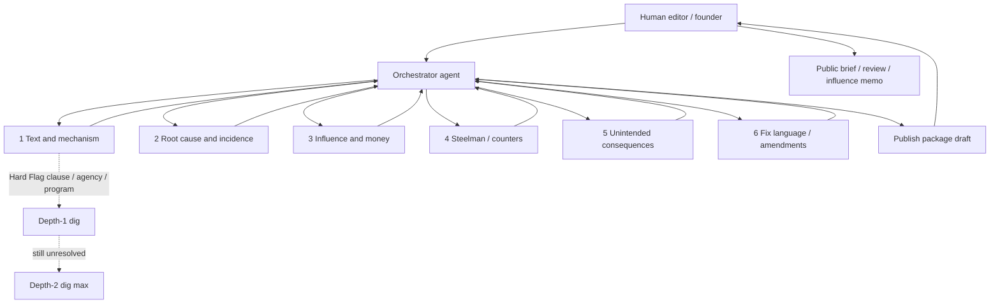

# CFMI AI Investigation Architecture

**Status:** Operating design for Phase 2 research (issues + legislation)  
**Implements:** [CHARTER.md](../CHARTER.md), [METHODOLOGY.md](../METHODOLOGY.md)  
**Audience:** Founder, human editors, Cursor agents running Task / multi-agent workflows

Educational research only—not legal advice, voting instructions, or counsel to any person.

---

## 1. Purpose

CFMI uses AI to find where **government creates barriers to free markets**, name the **root cause**, ask whether authority **overstepped constitutional or statutory bounds**, and design **rollback or elimination** that does not create worse rents, barriers, or opaque discretion.

**Central targets in current and proposed law:** corruption surfaces and crony capitalism—subsidies, entry barriers, opaque waivers, exclusive privileges, and political allocation dressed as public goods.

**Working pattern:** find the big issue → drill into smaller public datasets → deep investigation of *why / who / money / who benefits*—always under published rubrics, never as private detective work.

---

## 2. Core research questions (every investigation)

Every orchestrated pass must answer, or explicitly mark unanswered:

| # | Question |
|---|----------|
| 1 | What **operative barrier** blocks voluntary exchange (statute, rule, map, fee, franchise, board, discretion)? |
| 2 | What is the **root cause**—legal design, political coalition, fiscal incentive—not the press release? |
| 3 | Did government **overstep** enumerated powers, federalism, property/contract, or clear statutory limits? |
| 4 | Who **pays** and who is **blocked** from competing or building? |
| 5 | Who **benefits** from the status quo (incumbents, gatekeepers, fee recipients)—from public facts, not motive fiction? |
| 6 | What is the **least-coercive rollback** path, and what **greater problems** could repeal or reform cause? |
| 7 | Where do **corruption / crony** surfaces appear in current or proposed text (rents, barriers, opaque discretion)? |

---

## 3. Recommended architecture: bounded hierarchical investigation

**Judgment call:** Prefer a **bounded hierarchy** over unconstrained agent trees. One orchestrator frames and synthesizes; a **fixed set of specialist lanes** run in parallel; depth-limited sub-investigations open only when Hard Flags or evidence gaps justify them. A **human editor** is required before any public product.

Unconstrained recursive spawning fails CFMI’s needs: it burns context, invents sources, blurs Charter filters, and is hard to audit. Fixed lanes + depth caps keep work reproducible and publishable.



### 3.1 Orchestrator agent

**Owns:** problem framing, Charter/Methodology filters, lane assignment, synthesis, refuse rent-seeking asks, stop conditions, handoff to human editor.

**Does:**

1. Restate the issue or bill in Charter terms (barriers, rents, discretion, constitutional hooks).  
2. Separate **public narrative** from **operative mechanism** early (METHODOLOGY §4.7).  
3. Assign the six specialist lanes with a shared evidence standard and output schema.  
4. Spawn depth-limited digs only when Hard Flags fire or a named clause/agency/program needs a smaller dataset.  
5. Synthesize a single publish package; flag contradictions between lanes.  
6. Refuse asks whose primary goal is a subsidy, barrier, or privilege for a private interest (METHODOLOGY §1 disqualifiers).

**Does not:** invent citations; allege private motives; publish without a human editor; run unbounded recursion.

### 3.2 Fixed specialist lanes (parallel)

Run these six—not endless free-form roles. Parallelize when the tool allows (e.g. Cursor Task tool).

| # | Lane | Mandate | Primary artifacts |
|---|------|---------|-------------------|
| 1 | **Text & mechanism** | Operative legal language; hidden barriers vs talking points | Bill text, code cites, §4.7 checklist |
| 2 | **Root cause & incidence** | Who pays, who is blocked; least-coercive rollback options ranked | Problem statement, incidence notes |
| 3 | **Influence & money** | Public LDA / OpenSecrets / sponsors only; METHODOLOGY §7 rules | Influence memo draft |
| 4 | **Steelman / counterarguments** | Strongest honest defense of status quo; passability without Charter breach | Counters section |
| 5 | **Unintended consequences & safeguards** | What rollback could make worse; sunsets, thresholds, rural/consumer protections | Safeguards section |
| 6 | **Fix language / sample amendments** | Open bipartisan comment language; no new rents | Fix pack / amendment sketches |

Lane 3 is optional on pure issue briefs with no bill ID; when skipped, the orchestrator records “influence pass deferred—no bill hook / no Hard Flag trigger.”

### 3.2a Parallel specialist: Consensus claim tester (when triggered)

When Stage 2 surfaces a **high-consensus claim**—institutional (“the system is secure”) *or* viral (“the election was stolen”)—spawn a **Consensus claim tester** in parallel with lanes 1–6. Full rules: [anti-narrative-capture.md](anti-narrative-capture.md).

**Mandate:** Find the strongest evidence **for** and **against** the claim; require operative mechanisms and a threat model before accepting “secure” or “unsafe.” Training-data prevalence ≠ truth.

**Hard bans:** vibe-based reassurance; vibe-based alarm; authority laundering from any side.

Lane output feeds the orchestrator’s Stage 2 table; it does not replace Text & mechanism or Steelman lanes.

### 3.3 Drill-down protocol (depth-limited)

**When:** Orchestrator may spawn a sub-investigation only if:

- A dimension score would be ≤ 1 (**Hard Flag**), or  
- Artificial-manipulation language matches the Charter definition, or  
- A specific clause, agency, named program, or fee schedule is the contested mechanism and public data exists to dig.

**Limits:**

| Rule | Cap |
|------|-----|
| Max depth | **2** preferred; **3** only with human approval mid-investigation |
| Breadth per dig | One clause **or** one agency **or** one named program—not a new domain |
| Parallel digs per parent | ≤ 3 active at once |
| Nesting | Child digs do not invent new specialist types; they reuse lanes 1–6 on a narrower charter |

**Each dig receives:**

1. **Narrow charter** — one sentence: what question this dig must close.  
2. **Evidence standard** — primary text / public filings / published data; “not established in this pass” when missing.  
3. **Structured return** — findings, sources, Hard Flags, open questions, recommendation to stop or escalate one level.

### 3.4 Stop conditions

Stop the tree (and synthesize) when any apply:

| Condition | Meaning |
|-----------|---------|
| **Evidence exhaustion** | Public sources at Methodology rungs are spent; further claims would be speculation |
| **Charter disqualifier** | Project fails §1 disqualifiers or is primarily rent-seeking |
| **Diminishing returns** | New passes add slogans, not mechanisms or citations |
| **Depth cap** | Digs hit depth 2 (or 3 with approval) without closing the question |
| **Human review gate** | Material disagreement between lanes, legal risk, or publish-ready draft |

### 3.5 Human editor (required)

A named human accepts, revises, or rejects the AI publish package before anything is treated as public CFMI product (METHODOLOGY §2.4). Disagreements with AI scores or influence notes are recorded in the product.

---

## 4. Pipeline stages

Run in order. Skip only with an explicit orchestrator note.

| Stage | Name | Output |
|-------|------|--------|
| 1 | **Scan** | Scope: bill/issue ID, domain, candidate barriers, initial Hard-Flag suspects |
| 2 | **Narrative vs mechanism** | §4.7 table: talking points vs operative rulebook |
| 3 | **Root cause** | Why the barrier exists; incidence (who pays / who is blocked) |
| 4 | **Influence** | §7 memo notes when Hard Flags + public filings allow |
| 5 | **Counters** | Steelmans; passability constraints that do not breach Charter |
| 6 | **Rollback options** | Ranked least-coercive paths; what “eliminate” would require |
| 7 | **Safeguards** | Unintended consequences; anti-capture clauses |
| 8 | **Publish package** | Score (if bill), Hard Flags, influence notes, fix language, open questions |

**Publish package checklist:**

1. Identification (issue slug or bill ID)  
2. One-paragraph summary  
3. Narrative vs mechanism  
4. Rubric scores + hooks (bills) or priority fit (issues)  
5. Hard Flags  
6. Influence notes (or deferred)  
7. Rollback / fix language  
8. Safeguards + open questions  
9. Disclosure: models/providers if known, rubric version, date, human editor  

Map packages into existing templates: issue brief, bill review, influence companion—not a fourth public product type unless the founder adds one.

---

## 5. Honesty about limits

### What multi-agent structure helps with

- Parallel coverage of text, incidence, filings, counters, and safeguards without one model “forgetting” a lane.  
- Forcing narrative/mechanism separation before advocacy language creeps in.  
- Bounded digs on a clause or program when the parent pass is too coarse.  
- Structured synthesis the human editor can audit against Charter filters.

### What still needs humans, FOIA, journalists, or counsel

| Gap | Why AI (even multi-agent) is weak |
|-----|-----------------------------------|
| **Subtle political manipulation** | Side deals, informal whip pressure, and “understandings” leave little public text; agents over-infer from correlation |
| **Causation of a statutory line** | LDA “lobbying on” ≠ proof a client wrote the clause (§7.4) |
| **Non-public records** | Closed meetings, sealed settlements, internal agency emails—need FOIA / journalism / discovery |
| **Live citation integrity** | Models hallucinate URLs and bill sections; humans verify before publish |
| **Legal advice / tax / formation** | Outside research products; counsel only |
| **Strategic passability** | Local coalitions and vote counts need political judgment, not just steelman text |

**Rule of thumb:** If the claim cannot rest on public text, filings, or published data, write **“not established from public sources in this pass”** and stop digging in-agent. Escalate to a human for FOIA, reporter outreach, or counsel—not another recursive agent.

---

## 6. Map to existing CFMI artifacts

| Concern | Artifact |
|---------|----------|
| Scoring rubric & Hard Flags | [METHODOLOGY.md](../METHODOLOGY.md) §2 |
| Hidden barriers / talking points | [METHODOLOGY.md](../METHODOLOGY.md) §4.7 · [issue brief template](../ai-reviews/issues/_brief-template.md) |
| Influence & money rules | [METHODOLOGY.md](../METHODOLOGY.md) §7 · [influence-template.md](../ai-reviews/influence-template.md) |
| Bill review shape | [sample-bill-review-template.md](../ai-reviews/sample-bill-review-template.md) |
| Issue briefs / steelman | [METHODOLOGY.md](../METHODOLOGY.md) §4.6 · [`ai-reviews/issues/`](../ai-reviews/issues/) |
| Suggestion queue | [ops/suggestion-ranking.md](suggestion-ranking.md) · [`ai-reviews/suggestions/QUEUE.md`](../ai-reviews/suggestions/QUEUE.md) |
| Counterevidence intake | [.github/ISSUE_TEMPLATE/counterevidence.yml](../.github/ISSUE_TEMPLATE/counterevidence.yml) · [docs/feedback.html](../docs/feedback.html) |
| Unintended consequences | [docs/unintended-consequences-template.md](../docs/unintended-consequences-template.md) |
| Cursor prompts | [ops/prompt-playbook.md](prompt-playbook.md) Phase 2 (I1–I4) |
| Narrative capture defenses | [ops/anti-narrative-capture.md](anti-narrative-capture.md) |
| Worked example (elections / SAVE Act) | [ai-reviews/issues/election-administration-integrity.md](../ai-reviews/issues/election-administration-integrity.md) |

---

## 7. Copy-paste prompts (Cursor / Task workflow)

### 7.1 Orchestrator prompt

```
You are the CFMI Investigation Orchestrator for [BILL ID or ISSUE SLUG].

Read and obey CHARTER.md and METHODOLOGY.md (§2 rubric, §4.7 hidden barriers, §7 influence).
Educational research only—not legal advice or voting instructions.

Mission focus:
- Barriers to free markets; root cause; whether government overstepped;
  least-coercive rollback/elimination without greater problems.
- Corruption / crony capitalism surfaces in current or proposed law.
- Big issue → smaller public datasets → why/who/money/who benefits from public facts.

Architecture (mandatory):
1. Frame the problem in Charter terms; refuse rent-seeking primary goals.
2. Spawn exactly these specialist lanes in parallel (Task / sub-agents)—do not invent new roles:
   (1) Text & mechanism  (2) Root cause & incidence  (3) Influence & money
   (4) Steelman / counters  (5) Unintended consequences & safeguards
   (6) Fix language / sample amendments
   If Stage 2 surfaces a high-consensus claim (institutional or viral), also spawn
   Consensus claim tester per ops/anti-narrative-capture.md—do not invent other roles.
3. Depth-limited digs only: max depth 2 (3 only if I approve). Each dig = one clause OR one agency OR one named program; narrow charter + structured return.
   Prefer escalation digs on: disclosed messaging-org funding; what audits measure vs don't;
   statutory gaps vs practice; legal standards for challenging rolls.
4. Stop on evidence exhaustion, Charter disqualifier, diminishing returns, or human review gate.
5. Synthesize one publish package: narrative vs mechanism, scores/Hard Flags (if bill), influence notes or deferred, rollback/fix language, safeguards, open questions.
6. Do not publish. Hand off to a human editor. Mark unverified claims "not established from public sources in this pass."
7. No private motives, doxxing, or causation claims from lobbying correlation alone.

Return: structured synthesis + which digs you spawned and why + recommended template path
(issue brief / bill review / influence companion).
```

### 7.2 Specialist sub-agent prompt template

```
You are CFMI specialist lane [N: NAME] under the Investigation Orchestrator.

Lane mandate: [paste mandate from ops/ai-investigation-architecture.md §3.2]

Scope (narrow): [bill section / agency / program / issue facet only]
Parent question: [one sentence from orchestrator]
Depth: [0 parent lane | 1 | 2]
Evidence standard: public primary text, LDA/OpenSecrets/sponsors (lane 3), published data.
Obey METHODOLOGY §4.7 (narrative vs mechanism) and §7 (influence—no motive fiction).
Charter disqualifiers and anti-capture apply. Educational research only.

Return ONLY this structure:
1. Findings (bullets; quote or paraphrase operative hooks)
2. Sources (links or citations; mark unverified)
3. Hard Flags / artificial-manipulation matches (or none)
4. Who pays / who benefits (public facts only)—if in lane scope
5. Open questions (what a deeper dig or human/FOIA would need)
6. Recommendation: STOP | DIG once on [specific target] | ESCALATE to human

Do not spawn further agents unless the orchestrator asked for a dig at this depth.
Do not write the final publish package—that is the orchestrator’s job.
```

### 7.3 Suggested Cursor usage

1. Paste **§7.1** into the main agent (or a Task `generalPurpose` parent).  
2. Have it launch up to six Task sub-agents with **§7.2** filled per lane.  
3. If a high-consensus claim appears, also launch Consensus claim tester ([anti-narrative-capture.md](anti-narrative-capture.md) §6 / playbook **I4**).  
4. For Hard-Flag digs, resume or launch a child Task with depth 1–2 and a one-clause charter.  
5. Main agent synthesizes; founder/editor reviews before commit or site update.

---

## 8. Why this beats unconstrained agent trees

| Unconstrained tree | Bounded hierarchy (this doc) |
|--------------------|------------------------------|
| Roles multiply without audit trail | Six fixed lanes + named digs |
| Recursion until context collapses | Depth 2–3 hard stop |
| Motives and conspiracies fill gaps | §7 “not established” rule |
| Hard to reproduce for donors/public | Publish package maps to existing templates |
| Easy to launder rent-seeking asks | Orchestrator refuses §1 disqualifiers |
| “AI said so” authority creep | Human editor gate before publish |
| Consensus slogans close inquiry | Parallel Consensus claim tester ([anti-narrative-capture.md](anti-narrative-capture.md)) |

---

## 9. Resisting narrative capture

Full operating rules: **[anti-narrative-capture.md](anti-narrative-capture.md)**.

**Short form for every investigation:**

1. Treat high-consensus claims as **hypotheses**, not authorities.  
2. Require **operative mechanisms + threat models** before accepting “secure” / “unsafe.”  
3. Spawn the parallel **Consensus claim tester** when institutional or viral consensus would short-circuit analysis.  
4. **Ban** vibe-based reassurance and vibe-based alarm.  
5. Escalate digs on disclosed messaging funding, audit scope, statute vs practice—not on motive fiction.  
6. **Training-data prevalence ≠ truth.**

Worked example: election administration / list accuracy / mail custody / citizenship verification (SAVE Act)—see [election-administration-integrity.md](../ai-reviews/issues/election-administration-integrity.md). Domain note: constitutional process and anti-corruption transparency; free-market filters are secondary here.

---

## 10. Version

*Architecture version: 0.2.0 — bounded hierarchy + anti-narrative-capture (consensus claim tester).*
