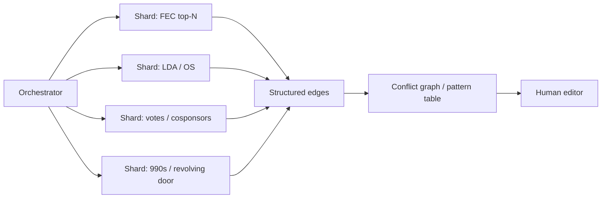

# AI Scale Pattern Mining

**Status:** Core CFMI dig capability (volume + pattern detection across public datasets)  
**Parent:** [ai-investigation-architecture.md](ai-investigation-architecture.md)  
**Implements:** [CHARTER.md](../CHARTER.md), [METHODOLOGY.md](../METHODOLOGY.md) §7.5–§7.7  
**Companions:** [claim-triage-from-viral-sources.md](claim-triage-from-viral-sources.md) · [civic-action-pack.md](civic-action-pack.md)  
**Playbook:** **I6** in [prompt-playbook.md](prompt-playbook.md)

Educational research only—not legal advice, voting instructions, or counsel to any person.

---

## 1. Purpose

AI’s advantage for CFMI digs is **volume + pattern detection** across public datasets faster than a human can manually cross-link. Scale pattern mining formalizes that advantage: shard queries across specialists, return structured edges, and surface **conflict graphs / pattern tables** that humans can audit.

**What this is:** Cross-linking public filings and legislative records at scale to find suspicious overlaps politicians and institutions have little incentive to surface.

**What this is not:** Private detective work, doxxing, motive fiction, or upgrading a suspicious pattern to “corruption” without a quid-pro-quo chain (METHODOLOGY §7.4–§7.5).

**Founder direction:** Dig through all available *public* information for conflicts and corruption-surface links. Mark gaps honestly. Hand off FOIA/journalism when public data stops.

---

## 2. Datasets in scope

Prefer primary filings and official records. Aggregators are aids, not authorities.

| Dataset class | Examples | Role |
|---------------|----------|------|
| **Lobbying** | Senate/House LDA; OpenSecrets bill/client pages | Who reported lobbying on the bill / theme |
| **Campaign finance** | FEC candidate/committee filings; OpenSecrets industry/PAC tables | Top donors / PACs / IEs in relevant cycles |
| **Nonprofit finance** | IRS Form 990s; ProPublica Nonprofit Explorer; org-published annual reports | Funders of lead advocacy orgs |
| **Legislative record** | Congress.gov votes, cosponsors, amendments, committee referrals | Timing and coalition patterns |
| **Personal financial disclosures** | STOCK Act / Senate & House disclosure portals (where available) | Holdings / trades overlapping contested issues |
| **Revolving door** | OpenSecrets Revolving Door; public bios tied to LDA | Prior employers of staff/sponsors/lobbyists |
| **State registries** | State lobbyist / ethics / campaign portals when the dig is state-scoped | Parallel disclosure outside federal LDA/FEC |
| **News corpora** | Press, floor transcripts, wire stories | **Leads only**—harvest candidate facts; resolve every published edge to filings/official records |

If a claim cannot rest on public text, filings, or published official datasets, write **“not established from public sources in this pass.”**

---

## 3. Pattern classes to hunt

Orchestrator assigns one or more classes per dig. Specialists search for **edges**, not narratives.

| Class | Hypothesis shape | Typical public signals |
|-------|------------------|------------------------|
| **Donor ↔ vote timing** | Large / clustered giving near contested votes or cloture | FEC / OS donor dates vs roll-call dates |
| **Advocacy org ↔ member overlaps** | Board, staff, spouse, or shared employer links to members or offices | 990 officers, LDA lobbyists, public bios |
| **Family / employer conflicts** | Family employment or member’s prior employer benefits from status quo | Disclosures, 990s, public employment records—**no doxxing**; public identities only |
| **Schedule priority inversion** | Stated #1 priority vs calendar / recess / competing floor vehicles | Daily Press, floor schedules, public statements |
| **Bill-text clones from lobby drafts** | Operative language matches publicly released industry/model drafts | Side-by-side text when both drafts are public |
| **Revolving door on relevant committees** | Staff/members ↔ regulated industry on the committee of jurisdiction | Revolving Door + committee assignment + LDA clients |

**Suspicion flags ≠ corruption.** Pattern tables may label edges **suspicious / moderate / weak**. Corruption = quid pro quo remains **not established** unless a public-record chain connects payment or privilege to a specific official act (§7.5 (C)).

---

## 4. Multi-agent map-reduce



### 4.1 Orchestrator

1. Frame the dig in Charter terms; name actors, bill/issue, date window.  
2. **Shard** queries by dataset and pattern class (one shard per specialist or batch).  
3. Cap breadth: prefer **top-N** donors, **named** cloture/roll-call sets, **lead** advocacy orgs—not unbounded scrape of every PAC in America.  
4. Merge specialist edges into one **conflict graph / pattern table**.  
5. Deduplicate; flag contradictions; never invent missing sources.  
6. Hand off to human editor before any public product.

### 4.2 Specialists (map)

Each specialist returns **only** structured edges:

```
Actor A — Relation — Actor B — Source — Grade
```

| Field | Rule |
|-------|------|
| **Actor A / B** | Named public entities (person, PAC, org, bill, roll call)—no private individuals without public official role |
| **Relation** | Concrete link type (e.g. `donated_to`, `lobbied_on`, `cosponsored`, `employed_by`, `voted_nay_cloture`, `board_overlap`) |
| **Source** | URL or filing citation; mark unverified |
| **Grade** | **strong** / **moderate** / **weak** / **not established** / **gap** (see §5) |

Specialists do **not** write the publish narrative or upgrade edges to bribery.

### 4.3 Reduce (orchestrator)

Merge edges → pattern table (and optional graph sketch). Group by pattern class. Attach:

- Which shards ran / which were skipped  
- False-positive notes (§7)  
- FOIA / journalist handoffs for **gap** cells  

---

## 5. Output: conflict graph / pattern table

**Minimum deliverable** — a pattern table:

| Pattern class | Actor A | Relation | Actor B | Timing / window | Source | Evidence grade | Notes |
|---------------|---------|----------|---------|-----------------|--------|----------------|-------|
| … | … | … | … | … | … | strong / moderate / weak / not established / gap | Suspicion only unless (C) chain |

**Optional:** adjacency-list or mermaid graph of the same edges for dense digs.

**Hard rule:** Never upgrade “suspicious pattern” to “corruption” or “quid pro quo” without a public-record chain (payment/privilege → specific official act). Default for (C): **not established**.

Separate layers in every product (METHODOLOGY §7.5):

| Label | Meaning |
|-------|---------|
| **(A)** | Disclosed financial / organizational interest |
| **(B)** | Stated policy reason |
| **(C)** | Corruption = quid pro quo — **not established** by default |
| **(D)** | Suspicion / process pattern — flagged, not equated to (C) |

---

## 6. Limits and FOIA handoff

| Limit | Honest treatment |
|-------|------------------|
| **Paywalled data** | Mark **gap**; do not invent behind the wall |
| **Incomplete LDA** | LDA under-reports issue specificity and timing; label noise |
| **Dark money / opaque vehicles** | Name vehicles only when disclosed; prefer “opaque political spending” when unsure (§7.1) |
| **Family / private employers** | Public records only; no doxxing or non-public personal data |
| **Causation** | Correlation of donor↔vote timing ≠ proof of vote-buying (§7.4) |

When public data stops: list **FOIA / journalist handoff** targets (agency, record type, why). Do not spawn recursive agents to fill the gap with speculation.

---

## 7. Honesty about false positives

Scale mining **will** produce false positives. Common traps:

- Industry aggregates that fund both parties and many issues  
- Shared geography / large employers that correlate with everything  
- Cosponsorship clusters that reflect caucus discipline, not capture  
- News leads that recycle each other without filings  
- Temporal proximity of donations to votes that is seasonal (election cycles), not act-specific  

Every pattern table must include a short **False-positive / alternative explanations** note. Prefer under-claiming. Human editor gate still required.

---

## 8. When required

**Required** on:

1. **SAVE-class digs** — stall / sandbagging / influence claims on high-salience election or constitutional-process bills.  
2. **Civic Action Packs** that publish **influence**, **special interest**, or **corruption-surface** claims.  
3. Viral/adversarial triage when sub-claims imply money, revolving door, or organized burial (run **after** falsifiable sub-claims; may parallel Deep public-records layer §7.6).

**Optional / deferred** on pure mechanism briefs with no named actor influence claim—orchestrator records “scale pattern mine deferred—no influence hook.”

Deep public-records layer (§7.6 / architecture §3.3a) remains the **per-actor** checklist. Scale pattern mining is the **cross-actor, cross-dataset** pass that §7.6 alone does not guarantee.

---

## 9. Worked stub pointer (Thune / SAVE)

What a human-scale dig checked vs what scale mining would run next:  
[`ai-reviews/claim-triage-thune-save-act-deep.md`](../ai-reviews/claim-triage-thune-save-act-deep.md) — **Appendix A: Next scale queries**.

---

## 10. Copy-paste: Scale pattern mine prompt (I6)

```
You are CFMI specialist: Scale pattern mining (map-reduce dig).

Obey CHARTER.md, METHODOLOGY.md §7.5–§7.7, ops/ai-scale-pattern-mining.md,
and ops/ai-investigation-architecture.md. Educational research only—not legal advice
or voting instructions.

Dig target: [BILL ID / ISSUE / NAMED ACTORS]
Date window: [e.g. 2024–2026]
Pattern classes to hunt: [donor↔vote timing | advocacy overlaps | family/employer |
schedule priority inversion | bill-text clones | revolving door — list all that apply]
Shards (orchestrator assigns): [FEC top-N | LDA/OS | Congress.gov votes/cosponsors |
990s | STOCK/PFD | revolving door | state registries]

Hard bans:
- Never upgrade "suspicious pattern" to corruption / quid pro quo without a public-record chain.
- No doxxing, private motives, or invented citations.
- News corpora = leads only; resolve edges to filings/official records.
- Training-data prevalence ≠ truth. Mark false-positive risks explicitly.

Pipeline:
1. Run assigned shards; return ONLY structured edges:
   Actor A — Relation — Actor B — Source — Grade
2. Orchestrator (or you if sole agent) merges into a conflict graph / pattern table
   with evidence grades (strong / moderate / weak / not established / gap).
3. Separate (A) disclosed interest · (B) stated reason · (C) quid pro quo (default
   not established) · (D) suspicion flags.
4. List FOIA/journalist handoffs for gaps (paywall, incomplete LDA, opaque vehicles).
5. Short false-positive / alternative-explanations note.

Return the pattern table (+ optional mermaid graph). Do not publish—hand off for human edit.
Stub example of checked vs next queries: ai-reviews/claim-triage-thune-save-act-deep.md Appendix A.
```

---

## 11. Version

*AI scale pattern mining version: 0.1.0 — cross-dataset map-reduce; structured edges; conflict graph / pattern table; suspicion ≠ corruption; required on SAVE-class and influence Civic Action Packs.*
