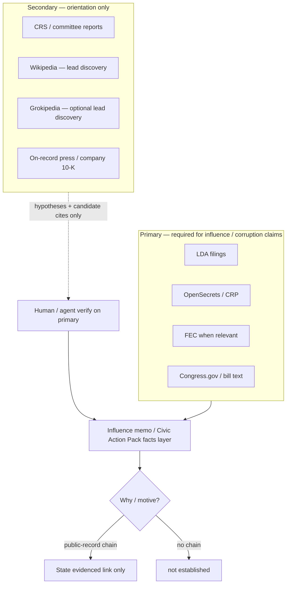

# External Sources & Grokipedia — Incorporation Proposal

**Status:** Decision record (bootstrap)  
**Date:** 2026-08-02  
**Implements:** [CHARTER.md](../CHARTER.md), [METHODOLOGY.md](../METHODOLOGY.md) §7, [ai-investigation-architecture.md](ai-investigation-architecture.md)  
**Audience:** Founder, human editors, Cursor agents

Educational research only—not legal advice, voting instructions, or counsel to any person. **CFMI does not claim IRS tax-exempt status.**

---

## 1. Decision (short)

| Question | Answer |
|----------|--------|
| What is Grokipedia? | xAI’s AI-generated online encyclopedia at [grokipedia.com](https://grokipedia.com/), launched **2025-10-27** (v0.1; later v0.2). Entries are produced or adapted by Grok; users suggest edits, Grok reviews. |
| Official Grokipedia API? | **No.** As of this note (2025–early 2026 reporting), there is **no public Grokipedia article API**. xAI offers a **Grok model API** (`api.x.ai`)—that is chatbot/model access, **not** a structured encyclopedia feed. CFMI has **no** Grokipedia API credentials or integration. |
| Incorporate as a core dependency? | **No.** |
| Optional research aid? | **Yes, with guardrails**—manual or future ToS-compliant browsing only; never sole evidence; never scrape in violation of terms. |
| Primary corruption / influence digs? | Stay on **public records** per METHODOLOGY §7: LDA, OpenSecrets, FEC, Congress.gov. “Why” only when evidenced; else **“not established.”** |

---

## 2. What Grokipedia is (facts for editors)

**Product.** AI encyclopedia operated by xAI (Elon Musk–founded). Live site; English; commercial; optional X-account sign-in to suggest articles/edits. Not a human-edited wiki; no direct public edit diffs like Wikipedia.

**Content mix (reported).**

- Many articles **adapted from Wikipedia** under **CC BY-SA 4.0** (footer notice when present); some near-verbatim at launch.  
- Other articles under the **X Community License** (reuse framed for non-commercial / research use, with commercial use constrained by xAI Acceptable Use—**verify current ToS before any reuse**).  
- Independent analysis (e.g. arXiv 2511.09685) and press have flagged citation-quality and bias concerns; Wikipedia community treats Grokipedia as **unreliable as a source** for Wikipedia’s own standards.

**Do not confuse with:**

| Product | What it is | CFMI status |
|---------|------------|-------------|
| **Grokipedia** | Web encyclopedia pages | Optional citation/lead source only; **no API** |
| **xAI Grok API** | Paid model inference API | Separate product; not “Grokipedia data access”; not claimed here |
| **Unofficial scrapers / third-party “Grokipedia APIs”** | Community or mirror sites | **Out of scope**—ToS risk; do not build on them |

---

## 3. Can CFMI incorporate it?

### Can (if ToS allows at time of use)

1. **Lead discovery** — An editor or agent may *read* a Grokipedia page to surface **candidate primary sources** listed in its citations, then verify those sources independently.  
2. **Background orientation** — Non-authoritative context on entities, statutes, or industry terms—same caution as any AI summary.  
3. **Attribution when quoting** — If a CC BY-SA adapted page is quoted/adapted into a CFMI work product, follow CC BY-SA (attribute Wikipedia/Grokipedia adaptation as the page states). For X Community License pages, follow that license and xAI ToS **before** republishing text. Prefer linking out over copying long passages.  
4. **Disclose use** — When Grokipedia materially shaped research leads, note it in the product’s AI/methods disclosure (model/providers already required).

### Cannot / will not

1. Claim **API access**, bulk dumps, or a production pipeline we do not have.  
2. Treat Grokipedia prose as **fact** for Hard Flags, influence tables, or “who pushed X and why.”  
3. Use Grokipedia (or any encyclopedia) to allege **private motives**, causation from lobbying dollars to a clause, or conspiracy narratives.  
4. Make CFMI products **depend** on X/xAI uptime, branding, or editorial slant.  
5. Scrape, mirror, or republish in ways that violate xAI/X terms or copyright.  
6. Launder partisan encyclopedia framing into (c)(3)-style educational products—keep CFMI non-partisan and filing-bound.

### Risks (summary)

| Risk | Mitigation |
|------|------------|
| **ToS / license ambiguity** | Prefer link-out; no bulk reuse; counsel review before any systematic republication |
| **Bias / capture** | Treat as one contested secondary; apply [anti-narrative-capture.md](anti-narrative-capture.md) |
| **Attribution / copyright** | Dual license (CC BY-SA vs X Community License)—check footer per page |
| **(c)(3) / educational posture** | Facts from public filings; no vote whip; no defamation; “not established” when thin |
| **Dependency on X/xAI** | Optional source only; primary stack is government + CRP aggregators |
| **Hallucinated citations** | Verify every URL and filing before publish |

---

## 4. Architecture: multi-source evidence (Grokipedia optional)

**Rule:** Secondary sources (including Grokipedia) may **suggest** what to look up. Only **primary** rungs (METHODOLOGY §7.2) support published influence facts. Encyclopedia narrative never closes a “why” question.

### 4.1 Influence lane (Lane 3)

Unchanged mandate: public LDA / OpenSecrets / sponsors; METHODOLOGY §7.

Optional add to specialist prompt evidence standard:

> You may consult Grokipedia or Wikipedia **only** to harvest candidate citations. Every claim in the influence table must resolve to LDA, OpenSecrets, FEC, Congress.gov, or another §7 rung. Mark motive/causation gaps **“not established from public filings in this pass.”** Do not cite Grokipedia as the source of a lobbying or spending fact.

### 4.2 Civic Action Packs (publish packages for civic use)

**Civic Action Pack** here means the orchestrator’s **publish package** shaped for civic readers and commenters: scored conflict (if a bill), Hard Flags with language hooks, disclosed influence notes, open fix/alignment language, and safeguards—not a vote whip.

| Pack layer | Allowed sources | Grokipedia role |
|------------|-----------------|-----------------|
| **Facts** | §7 rungs 1–4 (+ labeled rung-5 company statements) | None as authority |
| **Charter analysis** | Bill text + Charter/Methodology | None |
| **Alternatives** | In-repo fix language | None |
| **Research leads (internal)** | Any, including optional Grokipedia | Lead-only; strip before publish unless a verified primary cite remains |

Packs must still pair every influence map with **open fix language** (§7.1).

### 4.3 Corruption / “who pushes bad policy and why”

CFMI **does** dig into corruption **surfaces**—rents, barriers, opaque discretion, crony privileges—via public data.

| Dig question | How CFMI answers |
|--------------|------------------|
| **Who reported lobbying** on the bill / theme? | LDA / OpenSecrets |
| **Who sponsored / cosponsored?** | Congress.gov |
| **Who disclosed independent expenditures?** | FEC when cited |
| **Who benefits from the status quo?** | Incidence from statute/rule design + public facts (Lane 2)—not mind-reading |
| **Why did this provision exist?** | Only with a **public-record chain** (filing + text + dated statement). Else: **not established** |

Grokipedia (or Grok chat) must not supply the “why.” If an encyclopedia page asserts a motive narrative, treat it as a **hypothesis to test against filings**, then drop it if unverified.

---

## 5. Guardrails checklist (before any Grokipedia use)

- [ ] Use is optional; product would still stand if the site disappeared tomorrow.  
- [ ] No claim of API or bulk access.  
- [ ] Page license footer checked if any text is reused.  
- [ ] Every factual claim traced to §7 primary/aggregator sources.  
- [ ] No private motives, doxxing, or causation-from-correlation.  
- [ ] Non-partisan tone; anti-narrative-capture applied.  
- [ ] Human editor gate before publish.  
- [ ] Methods disclosure notes AI/encyclopedia lead use when material.

---

## 6. Revisit triggers

Re-open this decision if:

1. xAI ships a **documented, ToS-clear Grokipedia API or dump** with reusable licensing suitable for nonprofit research; or  
2. Counsel clears a specific reuse pattern; or  
3. Quality/bias evidence makes even lead-use untenable (then demote to “do not use”).

Until then: **optional lead source only; no integration work; no dependency.**

---

## 7. Related docs

| Doc | Role |
|-----|------|
| [METHODOLOGY.md](../METHODOLOGY.md) §7 | Binding influence source hierarchy |
| [ai-investigation-architecture.md](ai-investigation-architecture.md) | Bounded hierarchy; Lane 3; publish packages |
| [anti-narrative-capture.md](anti-narrative-capture.md) | Ban vibe/authority laundering from any encyclopedia |
| [influence-template.md](../ai-reviews/influence-template.md) | Public product shape for influence memos |

---

## 8. Version

*Proposal version: 0.1.0 — no Grokipedia API claimed; optional lead-only; primary digs stay on public filings.*
